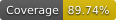

# components-to-nomad-jobs-action



This GitHub Action reads Roblox component configuration files, validates them,
and emits Nomad job definitions for each component.

## What it does

- accepts a JSON object of component keys to YAML config paths
- validates each component definition and applies default values
- resolves component resource overrides from the action inputs
- generates Nomad job HCL for each valid component
- writes the result to the `nomad-files` output as JSON

## Inputs

### `components` (required)

A JSON object mapping a component key like `example-api:1.2.3` to a path to a
component YAML file.

```yaml
with:
  components: '{"example-api:1.2.3": "./components/example-api.yaml"}'
```

### `datacenters` (optional)

Comma-separated Nomad datacenters to include in the generated job.

```yaml
with:
  datacenters: 'dc1, dc2'
```

### `resources` (optional)

Semicolon-separated resource overrides in the form `component,cpu:ram`.

```yaml
with:
  resources: 'example-api,500:256;example-worker,250:128'
```

## Outputs

### `nomad-files`

A JSON object keyed by component name and version containing the generated Nomad
job HCL.

## Example usage

```yaml
steps:
  - name: Checkout
    uses: actions/checkout@v4

  - name: Generate Nomad jobs
    id: nomad
    uses: roblox-devops/components-to-nomad-jobs-action@v1
    with:
      components: '{"example-api:1.2.3": "./components/example-api.yaml"}'
      datacenters: 'dc1, dc2'
      resources: 'example-api,500:256'

  - name: Show generated jobs
    run: echo "${{ steps.nomad.outputs.nomad-files }}"
```

## Local development

```bash
pnpm install
pnpm test
pnpm run package
```

This repository includes validation and Nomad generation tests under
[`__tests__/`](./__tests__). in their workflows.
